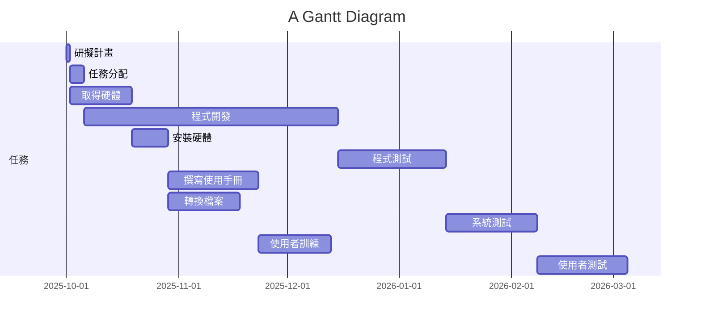
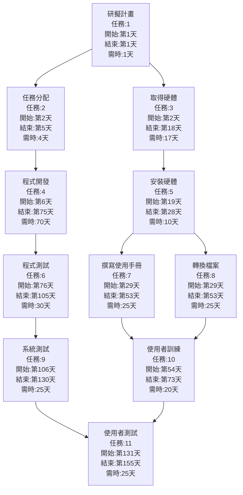

```mermaid
gantt
    title A Gantt Diagram

    section 任務
    研擬計畫           :a1, 2025-10-01, 1d
    任務分配     :a2,after a1  , 4d
    取得硬體      :a3,after a1  , 17d
    程式開發      :a4,after a2    ,    70d
    安裝硬體      :a5,after a3,    10d
    程式測試      :a6,after a4,30d
    撰寫使用手冊   :a7,after a5,25d
    轉換檔案      :a8,after a5,20d
    系統測試      :a9,after a6,25d
    使用者訓練    :a10,after a7 and a8,20d
    使用者測試    :a11,after a9 and a10,25d
```

```mermaid
flowchart TD
    no1["研擬計畫 <br> 任務:1 <br> 開始:第1天 <br> 結束:第1天 <br> 需時:1天"]
    no2["任務分配 <br> 任務:2 <br> 開始:第2天 <br> 結束:第5天 <br> 需時:4天"]
    no3["取得硬體 <br> 任務:3 <br> 開始:第2天 <br> 結束:第18天 <br> 需時:17天"]
    no4["程式開發 <br> 任務:4 <br> 開始:第6天 <br> 結束:第75天 <br> 需時:70天"]
    no5["安裝硬體 <br> 任務:5 <br> 開始:第19天 <br> 結束:第28天 <br> 需時:10天"]
    no6["程式測試 <br> 任務:6 <br> 開始:第76天 <br> 結束:第105天 <br> 需時:30天"]
    no7["撰寫使用手冊 <br> 任務:7 <br> 開始:第29天 <br> 結束:第53天 <br> 需時:25天"]
    no8["轉換檔案 <br> 任務:8 <br> 開始:第29天 <br> 結束:第53天 <br> 需時:25天"]
    no9["系統測試 <br> 任務:9 <br> 開始:第106天 <br> 結束:第130天 <br> 需時:25天"]
    no10["使用者訓練 <br> 任務:10 <br> 開始:第54天 <br> 結束:第73天 <br> 需時:20天"]
    no11["使用者測試 <br> 任務:11 <br> 開始:第131天 <br> 結束:第155天 <br> 需時:25天"]

    no1 --> no2
    no1 --> no3
    no2 --> no4
    no3 --> no5
    no4 --> no6
    no5 --> no7
    no5 --> no8
    no6 --> no9
    no7 --> no10
    no8 --> no10
    no9 --> no11
    no10 --> no11

```
# 關鍵路徑:no1->no2->no4->no6->no9->no11
